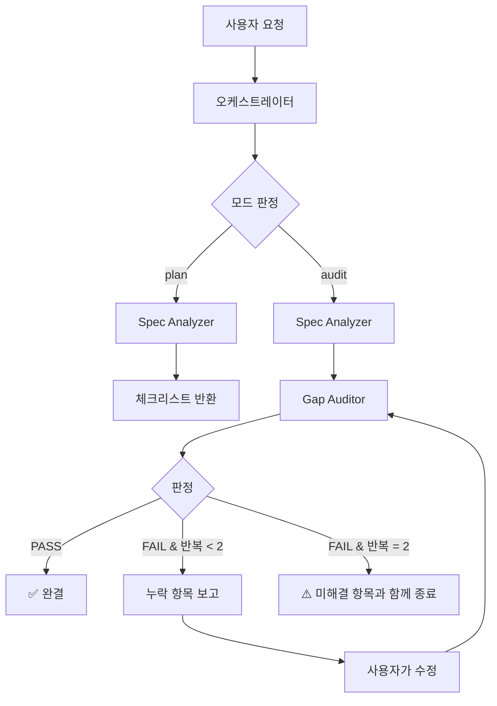

# Completeness Audit Orchestrator

## 개요

기획/구현/수정 작업에서 **놓친 부분**을 찾아내는 완결성 검토 오케스트레이터.
CLAUDE.md의 다단계 절차(예: "새 프로젝트 등록 절차")나 프로젝트 컨벤션 기준으로 빠진 파일·번역 키·등록 항목을 잡아낸다.

이 오케스트레이터는 Claude 내부 Agent 도구(서브에이전트)를 사용하여 구현한다. 외부 LLM API를 호출하지 않으며, Claude Code의 Agent 도구를 통해 각 에이전트를 실행한다.

- **패턴**: 라우터(모드 분기) + 파이프라인(Spec Analyzer → Gap Auditor) + 조건부 피드백 루프
- **에이전트**: Spec Analyzer (체크리스트 도출) → Gap Auditor (누락 보고)
- **최대 반복**: 2회 (audit 모드의 수정 루프)

---

## 호출 시점

다음 상황에서 오케스트레이터를 호출한다.

| 상황 | 모드 | 예시 |
|---|---|---|
| 새 작업을 시작하기 전 체크리스트가 필요할 때 | `plan` | "새 프로젝트 추가하려는데 뭘 건드려야 해?" |
| 작업을 마친 뒤 빠진 게 없는지 검증할 때 | `audit` | "boj-snippets 추가 끝났어. 빠진 거 있는지 봐줘" |
| 수정 중간에 놓친 부분을 물어볼 때 | `audit` | "지금까지 이 파일들 수정했는데, 더 해야 할 거 있어?" |

---

## 아키텍처 다이어그램



---

## 에이전트 정의

### Spec Analyzer Agent
- **역할**: 사용자 요청을 분석하여 "이 작업이 요구하는 모든 산출물"의 체크리스트를 도출
- **입력**: 요청 설명, 관련 파일 경로(있다면), 현재 작업 모드(plan/audit)
- **출력**: 체크리스트 테이블 (항목, 대상 파일/경로, 근거 규칙, 필수/선택)
- **도구**: Read, Glob, Grep (읽기 전용)
- **모델**: sonnet
- **정의 파일**: `.claude/agents/spec-analyzer.md`

### Gap Auditor Agent
- **역할**: Spec Analyzer의 체크리스트와 현재 파일/변경 상태를 비교하여 누락 항목을 보고
- **입력**: 체크리스트, 변경 파일 목록(또는 git diff), 작업 설명
- **출력**: PASS/FAIL 판정 + 누락 항목 테이블 + 다음 액션 제안
- **도구**: Read, Glob, Grep, Bash (git 명령 전용, 읽기)
- **모델**: sonnet
- **정의 파일**: `.claude/agents/gap-auditor.md`

---

## 오케스트레이션 흐름

### 모드 1: plan (작업 시작 전 체크리스트)

```
1. 사용자가 요청을 전달한다 ("X를 추가하고 싶어")
2. 오케스트레이터가 모드를 plan으로 판정
3. Spec Analyzer 호출
   - prompt: 요청 설명 + CLAUDE.md 경로 + 관련 스키마(project-schema.json 등) 위치
4. Spec Analyzer가 체크리스트를 반환
5. 오케스트레이터가 사용자에게 체크리스트를 제시하고 종료
```

### 모드 2: audit (작업 후 검증 + 수정 루프)

```
1. 사용자가 요청을 전달한다 ("X 작업 끝났어, 빠진 거 확인해줘")
2. 오케스트레이터가 모드를 audit으로 판정
3. Spec Analyzer 호출 → 체크리스트 획득
4. 변경 파일 목록 수집 (git status, git diff --name-only 활용)
5. Gap Auditor 호출
   - prompt: 체크리스트 + 변경 파일 목록 + 작업 설명
6. Gap Auditor가 PASS/FAIL 판정 반환
7. PASS → 완료
8. FAIL → 누락 항목을 사용자에게 보고하고 수정 요청
9. 사용자가 수정 완료를 알리면 5단계부터 재실행 (최대 2회)
```

### 루프 설계

- **루프 진입 조건**: Gap Auditor가 FAIL 판정
- **루프 종료 조건**:
  - Gap Auditor가 PASS 판정 (정상 종료)
  - 반복 횟수가 2에 도달 (강제 종료)
  - 사용자가 "남은 항목은 무시"로 명시적 종료
- **최대 반복 횟수**: 2회
- **피드백 신호**: Gap Auditor의 누락 항목 테이블 전체

### 모드 판정 규칙

오케스트레이터는 사용자 요청의 시제·동사로 모드를 판정한다.

| 신호 | 모드 |
|---|---|
| "추가하려는데", "만들려고", "~하고 싶어", "어떻게 해야 해?" | plan |
| "끝났어", "했어", "완료", "빠진 거", "확인해줘", "검토" | audit |

애매하면 사용자에게 한 번 물어본다.

---

## 에이전트 간 데이터 전달

서브에이전트는 부모의 대화 기록을 볼 수 없으므로 모든 컨텍스트를 명시적으로 전달한다.

| 구간 | 전달 방식 | 전달 내용 |
|---|---|---|
| 오케스트레이터 → Spec Analyzer | 프롬프트 | 작업 설명, CLAUDE.md 경로, 관련 스키마 파일 경로 |
| Spec Analyzer → 오케스트레이터 | 반환값 | 체크리스트 테이블 (마크다운) |
| 오케스트레이터 → Gap Auditor | 프롬프트 | 체크리스트 전체, 변경 파일 목록, 작업 설명 |
| Gap Auditor → 오케스트레이터 | 반환값 | PASS/FAIL 판정, 누락 항목 테이블, 다음 액션 제안 |

---

## 에러 처리

- **Spec Analyzer 실패**: 1회 재시도. 실패 시 CLAUDE.md만 직접 참조한 최소 체크리스트로 대체 진행
- **Gap Auditor 실패**: 1회 재시도. 실패 시 체크리스트를 그대로 사용자에게 전달 (수동 확인 요청)
- **루프 발산 감지**: 동일 항목이 연속 2회 FAIL로 남으면 사용자 수동 개입 요청
- **체크리스트 과생성**: 체크리스트 항목이 20개를 초과하면 "필수"와 "선택"으로 분리하여 제시

---

## 실행 예시

### 모드: plan (작업 시작 전)

```
사용자: "새 프로젝트 'ai-devkit' 추가하려고 해. 뭘 건드려야 해?"

→ 오케스트레이터: 모드 = plan
→ Spec Analyzer: CLAUDE.md "새 프로젝트 등록 절차" 파싱 + 기존 project-*.json 샘플링
← Spec Analyzer:
  | # | 항목 | 대상 파일 | 필수 |
  |---|---|---|---|
  | 1 | 상세 데이터 | public/data/projects/ai-devkit.json | 필수 |
  | 2 | 한글 번역 | public/locales/ko/projects/project-ai-devkit.json | 필수 |
  | 3 | 영문 번역 | public/locales/en/projects/project-ai-devkit.json | 필수 |
  | 4 | 카드 등록 | public/data/projects-list.json (배열 추가) | 필수 |
  | 5 | 카드 번역 ko | public/locales/ko/projects.json | 필수 |
  | 6 | 카드 번역 en | public/locales/en/projects.json | 필수 |
  | 7 | 썸네일 | public/images/aiDevkit/Icon.png | 필수 |
  | 8 | 데모 GIF | public/images/aiDevkit/appGif.gif | 선택 |

✅ 사용자에게 전달 후 종료
```

### 모드: audit (작업 후 검증 — 1회 수정 후 통과)

```
사용자: "ai-devkit 추가 끝났어, 빠진 거 확인해줘"

[Iteration 1]
→ Spec Analyzer: 체크리스트 생성 (위와 동일, 8개 항목)
→ Gap Auditor: git diff --name-only로 변경 파일 수집 → 체크리스트와 대조
← Gap Auditor:
  **판정**: ❌ FAIL
  | # | 누락 항목 | 근거 |
  |---|---|---|
  | 5 | public/locales/ko/projects.json에 ai-devkit 키 미추가 | CLAUDE.md §4 |
  | 7 | public/images/aiDevkit/Icon.png 파일 없음 | CLAUDE.md §5 |

→ 사용자에게 보고, 수정 요청
→ 사용자: "수정 완료"

[Iteration 2]
→ Gap Auditor: 재검토
← Gap Auditor: **판정**: ✅ PASS

✅ 완료
```

### 강제 종료 경로

```
[Iteration 2 후에도 FAIL]

⚠️ 사용자에게 보고:
"2회 반복 후에도 다음 항목이 남아있습니다:
- #7 public/images/aiDevkit/Icon.png 파일 없음
수동으로 추가하거나, '무시' 하고 종료해주세요."
```
