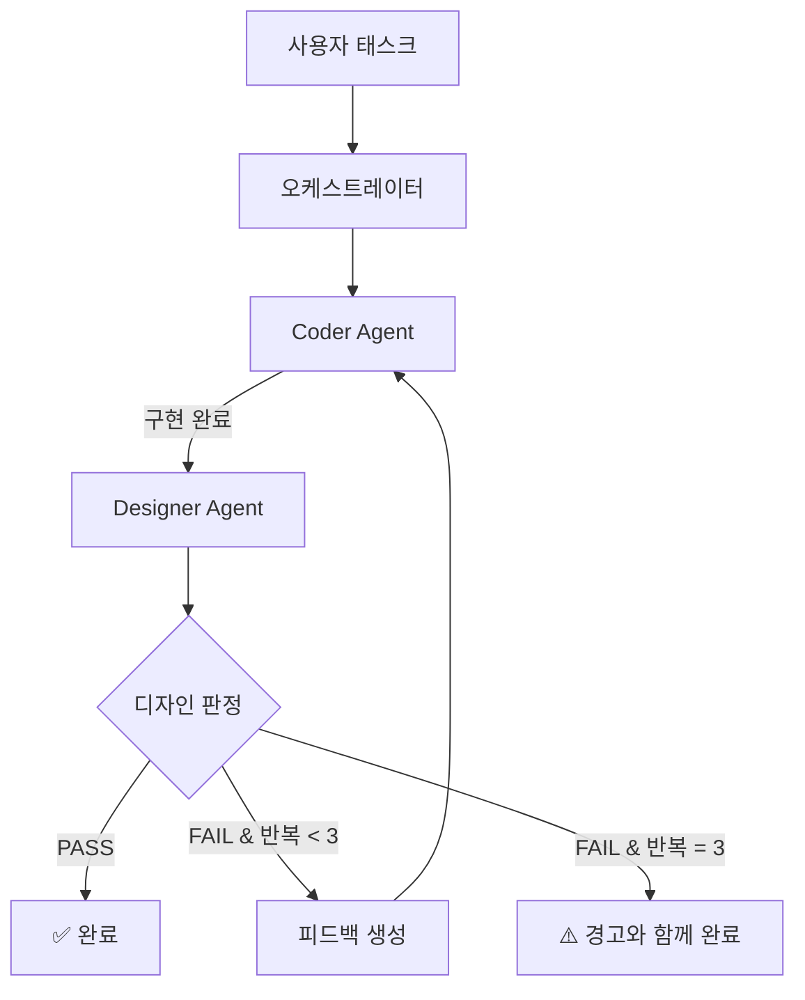

# Design Review Orchestrator

## 개요

기능 구현 시 기존 디자인 패턴과의 일관성을 자동으로 검증하는 오케스트레이터.
이 오케스트레이터는 Claude 내부 Agent 도구(서브에이전트)를 사용하여 구현한다. 외부 LLM API를 호출하지 않으며, Claude Code의 Agent 도구를 통해 각 에이전트를 실행한다.

- **패턴**: 파이프라인 + 피드백 루프
- **에이전트**: Coder (구현) → Designer (검증)
- **최대 반복**: 3회

---

## 아키텍처 다이어그램



---

## 에이전트 정의

### Coder Agent
- **역할**: 요청된 기능을 프로젝트 컨벤션에 맞게 구현
- **입력**: 태스크 설명 + (있다면) Designer 피드백
- **출력**: 변경된 파일 목록과 구현 요약
- **도구**: Read, Edit, Write, Glob, Grep, Bash
- **모델**: sonnet (빠른 구현)
- **정의 파일**: `.claude/agents/coder.md`

### Designer Agent
- **역할**: 구현된 코드의 디자인 일관성을 코드 리뷰로 검증
- **입력**: 변경 파일 경로 목록
- **출력**: PASS/FAIL 판정 + 위반 사항 테이블
- **도구**: Read, Glob, Grep (읽기 전용)
- **모델**: sonnet (정확한 판단)
- **정의 파일**: `.claude/agents/designer.md`

---

## 오케스트레이션 흐름

### 메인 흐름

```
1. 사용자가 태스크를 전달한다
2. 오케스트레이터가 Coder 에이전트를 호출한다
   - prompt에 태스크 설명, 관련 파일 경로, 프로젝트 컨텍스트를 포함
3. Coder가 구현을 완료하고 변경 파일 목록을 반환한다
4. 오케스트레이터가 Designer 에이전트를 호출한다
   - prompt에 변경 파일 경로와 "디자인 체크리스트 기준으로 검토해라"를 포함
5. Designer가 PASS/FAIL 판정을 반환한다
6. PASS → 완료
7. FAIL → 피드백을 Coder에게 전달하고 3단계로 돌아간다
```

### 루프 설계

- **루프 진입 조건**: Designer가 FAIL 판정을 내림
- **루프 종료 조건**:
  - Designer가 PASS 판정 (정상 종료)
  - 반복 횟수가 3에 도달 (강제 종료)
- **최대 반복 횟수**: 3회 (필수 상한)
- **피드백 신호**: Designer의 위반 사항 테이블 전체를 Coder에게 전달

### 피드백 전달 형식

Coder에게 재요청 시 프롬프트에 포함할 내용:

```
이전 구현에서 Designer가 다음 디자인 위반을 발견했다:

[Designer의 위반 사항 테이블 전체]

위 위반 사항을 수정해라. 수정한 파일과 변경 내용을 반환해라.
```

---

## 에이전트 간 데이터 전달

서브에이전트는 부모의 대화 기록을 볼 수 없으므로 모든 컨텍스트를 명시적으로 전달한다.

| 구간 | 전달 방식 | 전달 내용 |
|---|---|---|
| 오케스트레이터 → Coder | 프롬프트 | 태스크 설명, 관련 파일 경로, (있다면) Designer 피드백 |
| Coder → 오케스트레이터 | 반환값 | 변경 파일 목록, 구현 요약 |
| 오케스트레이터 → Designer | 프롬프트 | 변경 파일 경로 목록 |
| Designer → 오케스트레이터 | 반환값 | PASS/FAIL 판정, 위반 사항 테이블 |

---

## 에러 처리

- **Coder 실패**: 1회 재시도. 재시도도 실패하면 사용자에게 수동 개입 요청
- **Designer 실패**: 1회 재시도. 재시도도 실패하면 Coder 결과를 그대로 사용 (검증 건너뜀)
- **루프 발산 감지**: 3회 반복 후에도 FAIL이면 가장 마지막 구현을 사용하고 미해결 위반 사항을 사용자에게 보고

---

## 실행 예시

### 정상 경로 (1회 수정 후 통과)

```
사용자: "프로젝트 카드에 claudeInfo 뱃지를 추가해줘"

[Iteration 1]
→ Coder: PortfolioCard에 뱃지 컴포넌트 추가, rounded-md 사용
← Coder: "PortfolioCard/index.tsx 수정, 뱃지 추가 완료"

→ Designer: PortfolioCard/index.tsx 검토
← Designer: "FAIL — #12 위반: rounded-md → rounded-full 권장 (칩/태그는 rounded-full)"

[Iteration 2]
→ Coder: Designer 피드백 반영, rounded-md를 rounded-full로 수정
← Coder: "PortfolioCard/index.tsx 수정 완료"

→ Designer: PortfolioCard/index.tsx 재검토
← Designer: "PASS — 디자인 컨벤션 준수"

✅ 완료
```

### 강제 종료 경로 (3회 반복 초과)

```
[Iteration 3 후에도 FAIL]

⚠️ 사용자에게 보고:
"3회 반복 후에도 다음 위반이 남아있습니다:
- #18 위반: 애니메이션에 y-transform 없이 opacity만 사용
수동으로 확인해주세요."
```
