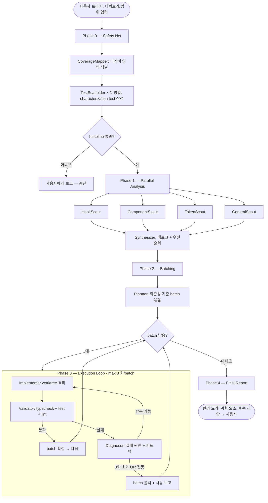

# Refactor Orchestrator

## 개요

코드베이스 전반에서 (1) 중복된 훅 로직, (2) 반복되는 컴포넌트 구조, (3) 하드코딩된 디자인 토큰을 찾아 추출·통합하는 자동 리팩토링 오케스트레이터. 그 외 일반 리팩토링(네이밍, 복잡도, 메모이제이션 등)은 자동 판단으로 함께 처리한다.

핵심 원칙은 **"안전망 먼저"** 다. 리팩토링 전 단계(Phase 0)에서 변경 영역의 characterization tests를 깐다. 이후 모든 변경은 typecheck + test 통과를 게이트로 검증되며, 실패 시 구체적 피드백과 함께 재시도하는 자동 루프로 수렴한다.

> **구현 기술**: 이 오케스트레이터는 Claude Code 내부의 `Agent` 도구(서브에이전트)를 사용하여 구현한다. 외부 LLM API를 호출하지 않으며, 메인 Claude(오케스트레이터)가 각 Phase에서 서브에이전트를 spawn 하여 작업을 분배·종합한다.

## 적용 컨텍스트 (mogiyoon 기준)

- 빌드 + 타입체크: `npm run build` (`tsc -b && vite build`)
- 빠른 타입체크: `npx tsc --noEmit`
- 테스트: `npm test` (vitest)
- 린트: `npm run lint`
- 테스트 라이브러리: vitest + @testing-library/react + jsdom

## 아키텍처 다이어그램



## Phase별 상세

### Phase 0 — Safety Net (테스트 안전망)

**목적**: 리팩토링 대상 코드의 현재 동작을 테스트로 고정한다. 이게 없으면 "리팩토링이 안전했는지" 판정할 수 없다.

**흐름**:
1. **CoverageMapper** (직렬, 1회) — 사용자가 지정한 범위(예: `src/components/`, `src/hooks/`)를 스캔하여:
   - 기존 테스트 파일과의 매핑
   - 테스트가 없는 공개 export
   - 우선순위 (사용 빈도 × 복잡도) 산출
   - 결과: `.claude/orchestrators/runs/<runId>/coverage-map.json`

2. **TestScaffolder × N** (병렬, 미커버 영역별로 1개씩) — 각 영역에 대해:
   - 기존 동작을 보존하는 characterization test 작성 (스냅샷, 렌더링, prop별 분기)
   - 시각적 회귀가 핵심인 컴포넌트는 `@testing-library/react`로 DOM 구조와 클래스 검증
   - 훅은 `renderHook`으로 입력→출력/사이드이펙트 검증
   - 결과: 새 테스트 파일들

3. **Baseline 게이트**: `npm test && npx tsc --noEmit` 통과해야 Phase 1으로 진입. 실패 시 중단하고 사용자 개입 요청.

**중요**: TestScaffolder는 새 테스트만 추가하고 프로덕션 코드는 절대 건드리지 않는다 (도구 제한: Write/Edit only on `**/*.test.ts(x)`).

### Phase 1 — Parallel Analysis (병렬 분석)

4개 Scout가 **하나의 메시지에서 동시 spawn** 되어 독립적으로 분석한다. 각자 결과 파일을 쓴다.

| Scout | 찾는 것 | 출력 |
|---|---|---|
| **HookScout** | 컴포넌트 안에 인라인된 `useEffect`/`useState`/`useMemo` 패턴 중 2회 이상 반복되는 것, 같은 의존성 배열로 같은 일을 하는 것 | `hook-candidates.json` |
| **ComponentScout** | 유사한 JSX 구조 (같은 props 시그니처, 90%+ 유사 마크업), 컴포넌트 분할 가능 지점 | `component-candidates.json` |
| **TokenScout** | 하드코딩된 색상(`#xxxxxx`, `bg-[...]`), 매직 넘버 spacing/radius, 중복되는 클래스 조합 → Tailwind 토큰 또는 디자인 토큰으로 통합 가능한 것 | `token-candidates.json` |
| **GeneralScout** | 위 3개에 안 잡히는 것: 네이밍, 죽은 코드, 과도한 prop drilling, 누락된 메모이제이션 | `general-candidates.json` |

**Synthesizer** (직렬, 1회) — 4개 결과를 읽고:
- 중복 제거 및 통합
- 우선순위 점수 매기기 (영향 범위 × 안전도 / 위험도)
- `backlog.json` 생성 (각 항목: id, type, files, description, dependencies, risk)

### Phase 2 — Batching (계획)

**Planner** — `backlog.json`을 읽고 batch 단위로 묶는다.

**배치 규칙**:
- 같은 파일을 수정하는 항목은 같은 batch
- A를 추출해야 B가 가능한 의존 관계는 순차 batch
- 한 batch는 5~10개 변경 이내 (검증 시간 + 롤백 용이성)
- 디자인 토큰은 별도 batch로 (영향 범위가 넓고 시각적 검증 필요)

결과: `plan.json` — `[{batchId, items[], affectedFiles[], rollbackStrategy}]`

### Phase 3 — Execution Loop (실행 루프)

각 batch에 대해 최대 3회 시도하는 수렴 루프.

```
for batch in plan:
    iteration = 0
    feedback = null
    while iteration < 3:
        # 1. Implementer (worktree 격리)
        result = Agent("Implementer",
                       isolation="worktree",
                       prompt=batch + previous_feedback)

        # 2. Validator
        validation = Agent("Validator",
                           cwd=result.worktree_path,
                           tools=[Bash])
        # 실행: npx tsc --noEmit && npm test -- --run && npm run lint

        if validation.passed:
            merge_worktree(result.worktree_path)
            break

        # 3. Diagnoser
        diag = Agent("Diagnoser",
                     prompt=validation.errors + batch context)
        feedback = diag.actionable_feedback

        # 진동 감지: 같은 에러 시그니처가 2회 반복되면 조기 종료
        if same_error_as_last_iteration(diag, last_diag):
            mark_batch_skipped(batch, reason="oscillation")
            break

        iteration += 1

    if iteration == 3:
        mark_batch_skipped(batch, reason="max_iterations")
```

**worktree 격리의 이유**: 병렬은 아니지만, 실패한 batch가 main 작업 트리를 오염시키지 않게 한다. `Agent({ isolation: "worktree", ... })` 사용. 통과한 batch만 메인 트리에 머지.

### Phase 4 — Final Report

**Reporter** — 모든 batch 결과를 수집해 마크다운 리포트 생성:
- 적용된 변경 요약 (batch별 diff 요약)
- 스킵된 batch와 이유 (사람 검토 필요 항목)
- 추가된 테스트 목록
- 다음 단계 제안 (예: 디자인 토큰 추출 후 후속 정리)
- 결과: `.claude/orchestrators/runs/<runId>/report.md`

## 에이전트 정의

| 에이전트 | 역할 | 도구 | 모델 | 권한 |
|---|---|---|---|---|
| CoverageMapper | 테스트 미커버 영역 식별 | Read, Grep, Glob, Write | sonnet | readonly + 1개 산출물 |
| TestScaffolder | characterization test 작성 | Read, Write, Edit (`*.test.*` 한정) | sonnet | 테스트 파일만 |
| HookScout | 중복 훅 패턴 탐지 | Read, Grep, Glob, Write | sonnet | readonly + 1개 산출물 |
| ComponentScout | 중복 컴포넌트 구조 탐지 | Read, Grep, Glob, Write | sonnet | readonly + 1개 산출물 |
| TokenScout | 하드코딩 토큰 탐지 | Read, Grep, Glob, Write | sonnet | readonly + 1개 산출물 |
| GeneralScout | 그 외 리팩토링 후보 | Read, Grep, Glob, Write | sonnet | readonly + 1개 산출물 |
| Synthesizer | 4개 후보 통합 + 우선순위 | Read, Write | opus | 분석 정밀도 우선 |
| Planner | 의존성 기준 batch 그룹화 | Read, Write | sonnet | — |
| Implementer | 실제 코드 변경 | Read, Edit, Write, Bash | sonnet | worktree 격리 |
| Validator | 빌드/테스트/린트 실행 | Bash | haiku | 명령 실행만 |
| Diagnoser | 실패 원인 + 피드백 생성 | Read, Bash | opus | 정밀 진단 |
| Reporter | 최종 리포트 작성 | Read, Write | sonnet | — |

**모델 선택 근거**: 
- 평가/진단/통합처럼 정밀 판단이 필요한 곳은 `opus`
- 단순 명령 실행(Validator)은 `haiku`로 비용 절감
- 나머지 일반 작업은 `sonnet`

## 데이터 전달 규약

서브에이전트는 부모 대화를 못 본다. 모든 컨텍스트는 **파일 + 프롬프트**로 명시 전달한다.

**작업 디렉토리 구조** (`.claude/orchestrators/runs/<runId>/`):
```
runs/2026-05-01-1430/
├── inputs.json              # 사용자가 지정한 범위/옵션
├── coverage-map.json        # Phase 0
├── hook-candidates.json     # Phase 1 (× 4 Scout)
├── component-candidates.json
├── token-candidates.json
├── general-candidates.json
├── backlog.json             # Synthesizer
├── plan.json                # Planner
├── batches/
│   ├── batch-001/
│   │   ├── attempt-1.diag.json
│   │   ├── attempt-2.diag.json
│   │   └── result.json      # passed | skipped + reason
│   └── batch-002/...
└── report.md                # Phase 4
```

**프롬프트 템플릿 (예: Implementer)**:
```
Read these files first:
- /path/to/runs/<runId>/plan.json (focus on batchId={X})
- Each file in batch.affectedFiles[]
- Previous attempt feedback (if any): /path/to/batch-{X}/attempt-{N-1}.diag.json

Apply the changes described in batch {X}. Constraints:
- Do not modify any *.test.* files
- Preserve all public exports unless explicitly listed in the batch
- Run `npm test -- <related-test-file>` after each file change to catch issues early

Write a summary of changes to /path/to/batch-{X}/changes.md.
```

## 에러 처리 및 복구

| 상황 | 대응 |
|---|---|
| Phase 0 baseline 실패 | 즉시 중단, 사용자에게 실패한 테스트 보고 (이미 깨진 코드는 리팩토링 대상이 아님) |
| Scout 1개 실패 | 나머지 3개 결과로 진행. Synthesizer에 missing 표시 |
| Implementer가 worktree에서 실패 | worktree 보존하고 Diagnoser가 그 경로에서 디버그 |
| Validator typecheck/test 실패 | 에러 메시지 + 실패 파일 위치 → Diagnoser가 actionable feedback 생성 |
| 진동 감지 | 같은 error signature(에러 메시지 첫 줄 + 파일 경로)가 2회 반복되면 batch skip |
| 최대 반복(3회) 초과 | batch skip + 사람 검토 표시. worktree는 보존하여 사람이 확인 가능 |
| Diagnoser가 "이 batch는 잘못 묶였다"고 판단 | Phase 2로 일부 되돌려 batch 재구성 (1회만 허용, 무한 회귀 방지) |
| 디자인 토큰 batch 실패 | 시각적 회귀 가능성이 높으므로 자동 머지 금지, 항상 사람 승인 요구 |

**타임아웃**:
- Scout/Implementer: 10분
- Validator: 5분 (테스트 스위트 크기에 따라 조정)
- 초과 시: 진행 중인 단계만 skip, 다음 batch로

## 실행 예시

### 정상 경로

```
사용자: "src/components/와 src/hooks/ 를 대상으로 리팩토링 오케스트레이터 돌려줘"

오케스트레이터:
  → runs/2026-05-01-1430/inputs.json 생성
  → CoverageMapper: 22개 컴포넌트 중 4개만 테스트 있음
  → TestScaffolder × 18 (병렬, 4분 소요)
  → npm test: 통과 (84개 테스트, 신규 64개)
  → npx tsc --noEmit: 통과
  → Phase 1: HookScout/ComponentScout/TokenScout/GeneralScout 병렬 (3분)
  → Synthesizer: 27개 후보 → 19개로 통합, 우선순위 부여
  → Planner: 6개 batch로 그룹화

  → batch-001 (공통 훅 useFlipPreview 추출, 3개 컴포넌트 변경)
    Implementer (worktree) → Validator: 통과 → 머지
  → batch-002 (PortfolioCard 분할)
    Implementer → Validator: typecheck 실패 (props 타입)
    Diagnoser: "PortfolioCardProps에 onSelect 필드 누락"
    Implementer (재시도) → Validator: 통과 → 머지
  → batch-003 ~ 005: 모두 통과
  → batch-006 (디자인 토큰 통합): 시각적 회귀 우려 → 사람 승인 대기

  → Reporter: report.md 생성
사용자: "변경 13개 적용, 1개 batch는 사람 검토 필요. report.md 확인하세요."
```

### 실패 경로 (진동 감지)

```
batch-004 (반복되는 motion variants 추출):
  attempt 1 → Validator: 5개 컴포넌트에서 framer-motion 타입 에러
  Diagnoser: "Variants 타입에 transition 누락"
  attempt 2 → Validator: 3개 컴포넌트에서 동일 에러 + 2개 새 에러
  Diagnoser: "이전과 동일 에러가 남아있음 — 진동"
  → batch-004 skip, worktree 보존
  → 다음 batch 진행
```

## 트리거 방식

오케스트레이터는 메인 Claude(이 대화)에 다음 형태로 호출된다:

```
"리팩토링 오케스트레이터를 다음 범위로 돌려줘:
- 범위: src/components/, src/hooks/
- 제외: src/components/__tests__/, **/*.stories.tsx
- 옵션: max_iterations=3, design_tokens_require_approval=true"
```

메인 Claude는 이 문서를 읽고 위 Phase 0~4를 순차 실행한다.

## 자주 하는 실수 회피 체크리스트

- [x] 모든 루프에 max_iterations 명시 (3회)
- [x] 진동 감지 로직 (같은 에러 2회 → skip)
- [x] 피드백 없는 재시도 금지 (Diagnoser가 항상 actionable feedback 생성)
- [x] worktree 격리로 실패가 메인 트리 오염 방지
- [x] 도구 권한 최소화 (TestScaffolder는 테스트 파일만, Validator는 Bash만)
- [x] 컨텍스트 명시 전달 (파일 경로 + JSON 산출물)
- [x] Phase 0 baseline 게이트로 "이미 깨진 상태에서 리팩토링" 방지
- [x] 디자인 토큰처럼 시각적 검증이 필요한 변경은 자동 머지 금지

## 후속 개선 가능성

- Phase 0의 TestScaffolder 결과를 별도 PR로 분리하면 리뷰 부담 감소
- Phase 1 Scout 결과를 .claude/orchestrators/runs/ 외부에 보관하여 다음 실행 시 캐시
- Storybook이 도입되면 시각 회귀 테스트(Chromatic 등)를 Validator에 추가
